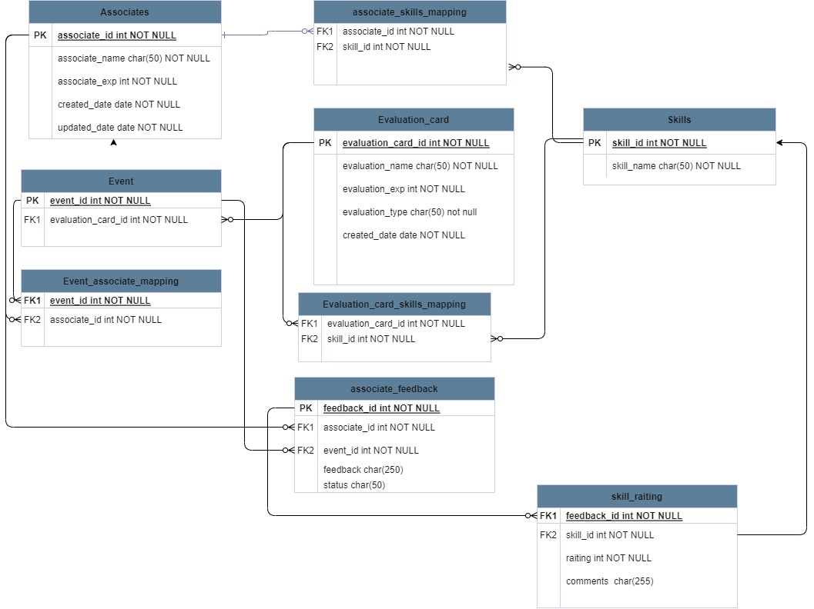
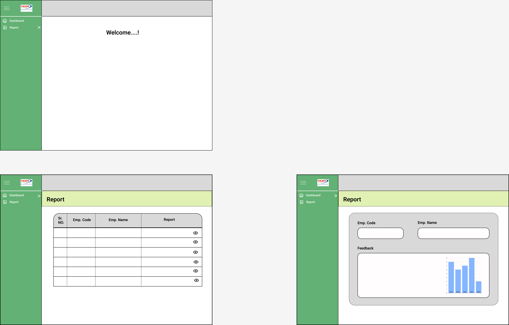

# EMS
Its a Employee Management System used by competancy team to onboard a employee,upload feedback,serach feedback and generate report

## Report Module
####
 This module is used to see feedback of associate in table and 
 bar chart.

### ER diagram

 
 
### Report module wireframe

